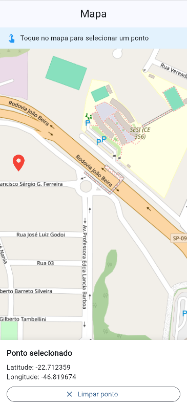

# 🗺️ App Map

Aplicativo desenvolvido em **Flutter** para visualizar um mapa e obter as coordenadas de um ponto selecionado.

## 📍 Funcionalidades

* Visualização do mapa utilizando OpenStreetMap;
* Seleção de um ponto ao tocar no mapa;
* Exibição da latitude e longitude;
* Marcador indicando o ponto selecionado;
* Opção para limpar o ponto.

## 🛠️ Tecnologias

* Flutter
* Dart
* flutter_map
* latlong2
* OpenStreetMap

## 🚀 Como executar

Instale as dependências:

```bash
flutter pub get
```

Execute o aplicativo:

```bash
flutter run
```

## 📦 APK

O arquivo APK está disponível na pasta `assets/`.

## 📱 Aplicativo



## 📂 Estrutura

```text
app_map/
├── assets/
│   ├── icone.png
│   ├── app_map.apk
│   └── print.png
├── lib/
│   └── main.dart
├── android/
├── pubspec.yaml
└── README.md
```
