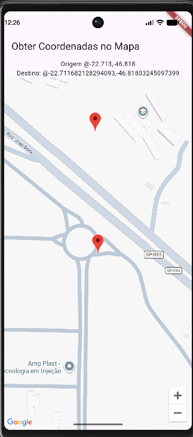

# 🗺️ App Google Maps

Aplicativo desenvolvido em **Flutter** utilizando o **Google Maps** para visualizar um mapa, selecionar pontos e obter suas coordenadas.

## 📍 Funcionalidades

- Visualização do mapa do Google Maps;
- Exibição de um ponto de origem;
- Seleção de um ponto diretamente no mapa;
- Exibição das coordenadas do ponto selecionado;
- Marcadores para identificar a origem e o destino.

## 🛠️ Tecnologias utilizadas

- Flutter
- Dart
- Google Maps
- Google Maps Flutter Plugin

## 📱 Funcionamento

Ao iniciar o aplicativo, o mapa é exibido com um marcador indicando o ponto de origem.

Ao tocar em qualquer local do mapa, um segundo marcador é adicionado e as coordenadas do ponto selecionado são apresentadas na tela.

### Demonstração



## 🚀 Como executar o projeto

Primeiro, instale as dependências do projeto:

```bash
flutter pub get
```

Depois, execute o aplicativo:

```bash
flutter run
```

O aplicativo pode ser executado em um dispositivo Android ou em um emulador Android.

## 🔑 Configuração da API

Para utilizar o Google Maps, é necessário:

1. Criar ou selecionar um projeto no Google Cloud Console;
2. Ativar o **Maps SDK for Android**;
3. Criar uma chave de API;
4. Configurar a chave de API no projeto Android;
5. Restringir a chave para o aplicativo Android.

## 📂 Estrutura do projeto

```text
app_google_maps/
├── android/
├── lib/
│   └── main.dart
├── assets/
│   └── print.png
├── pubspec.yaml
└── README.md
```

## 📌 Observação

O projeto utiliza a API do Google Maps para Android. Para executar o aplicativo corretamente, é necessário configurar uma chave de API válida no Google Cloud Console.
