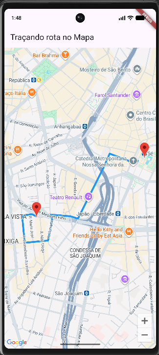

# Traçar Rota com Flutter e OSRM

Aplicativo Flutter que utiliza o **Google Maps** para exibir o mapa e a **API OSRM** para calcular e traçar uma rota entre dois pontos.

## Tecnologias utilizadas

* Flutter
* Dart
* Google Maps
* OSRM
* HTTP

## Resultado

O aplicativo exibe o mapa, os pontos de origem e destino e a rota calculada pela API OSRM.

## APK

O arquivo APK está disponível em:

`assets/tracar_rota.apk`
